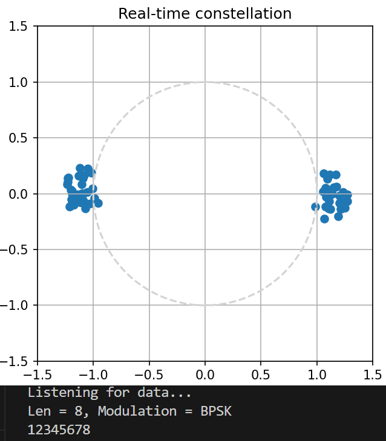
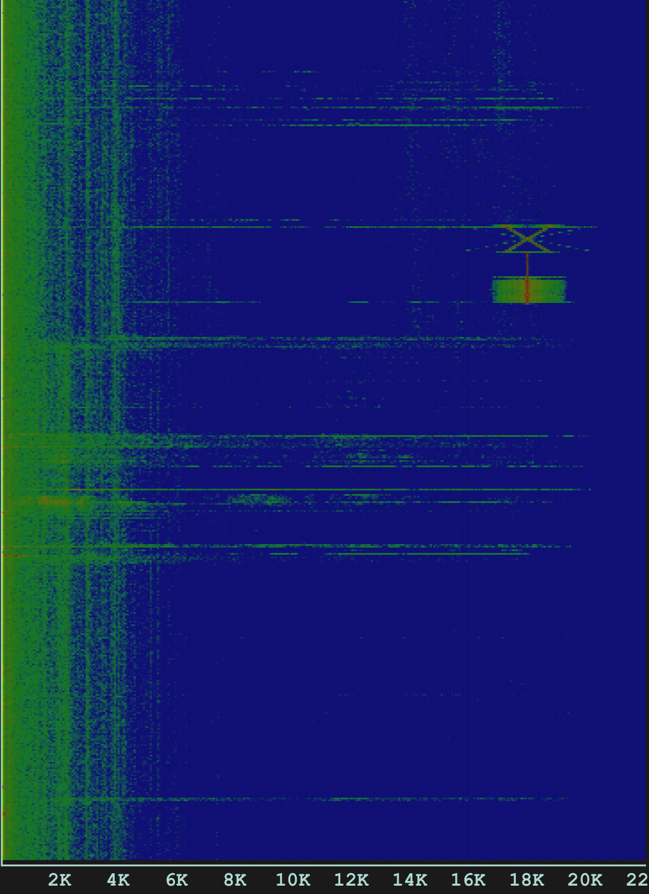

# Sonic UART

此项目希望通过音频线(交叉线)或空气实现18KHz中心频率下的实时音频通信。目前主要在Windows平台测试。

与一些使用FSK调制解调的音频通信项目不同，本项目会支持PSK/QAM/OFDM调制。由于设备性能千差万别，调制模式也是偏效率而非抗干扰取向，越是高阶调制越需要使用音频线来获得足够的SNR。

以下是空气传输的测试截图。

由于时间因素，目前项目还在艰难推进中。

